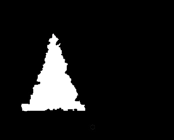
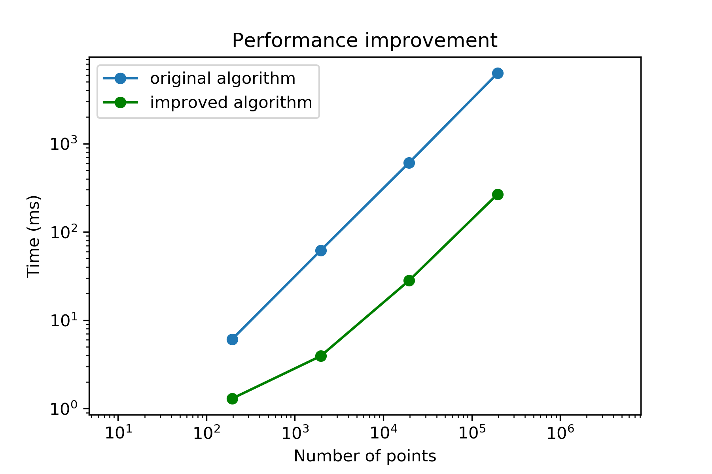

# PointRend
 An numpy-based implement of PointRend

This is an implement a PointRend function for Segmentation result refinement.
The paper can be find at https://arxiv.org/pdf/1912.08193.pdf

## Usage
copy the pointGenerate.py to your directory and you are ready to rock.
```
from pointGenerate import getpoint
my_mask = np.asarray(Image.open("tree_mask.jpg").resize((32,32)))
# convert this 3-channel binary mask to a 1-channel binary one
my_mask = my_mask[:,:,0]
# get the point, nearest_neighbor chose the sample points locations
points = getpoint(my_mask, k=2, beta = 0.95, nearest_neighbor=1)

# plot the result
points = list(zip(*points))
plt.imshow(my_mask,cmap="Purples")
plt.scatter(points[1],points[0],c='black',s=4)
```
## Some result
the original image and mask:




when the mask is 32*32


when the mask is 64*64


when the mask is 128*128


## Improvement
When I was using this, I find the speed is horrible , so I improved the point selection process by storing the process. The point selection process is significantly accelerated while the image is large. However you want to use the old one, just use ```getpoint(new_if_near=False)```. The performance improvement is shown below, and a fancy and totally unnecessary figure is plotted.


| #points  | original | improved |
|---|---|---|
| 196 | 6.11 ms ± 122 µs  | 1.3 ms ± 8.4 µs |
| 1960 | 61.8 ms ± 2.92 ms  | 3.93 ms ± 383 µs |
| 19600  | 609 ms ± 14.3 ms  | 28.2 ms ± 643 µs |
| 196000  | 6.28 s ± 99.9 ms  | 267 ms ± 12.7 ms |




## In the future
1. We will test this on V-Net to see if there are some segmentation performance boost.
2. If any one feel like trying the PointRend on Mask-rcnn, leave the comments in the issue.