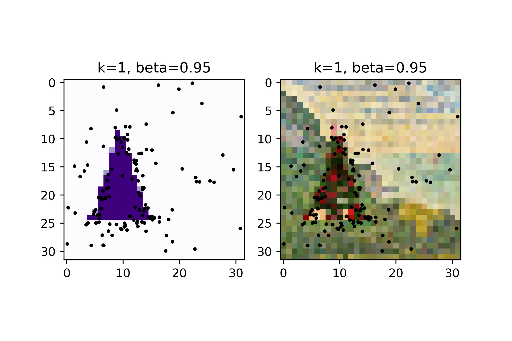

# PointRend
 An numpy-based implement of PointRend

This is an implement a PointRend function for Segmentation result refinement.
The paper can be find at https://arxiv.org/pdf/1912.08193.pdf

## Usage
```
from pointGenerate import getpoint
my_mask = np.asarray(Image.open("tree_mask.jpg").resize((32,32)))
# convert this 3-channel binary mask to a 1-channel binary one
my_mask = my_mask[:,:,0]
# get the point, nearest_neighbor chose the sample points locations
points = getpoint(my_mask, k=2, beta = 0.95, nearest_neighbor=1)

# plot the result
points = list(zip(*points))
plt.imshow(my_mask,cmap="Purples")
plt.scatter(points[1],points[0],c='black',s=4)
```
## Some result
the original image and mask:


when the mask is 32*32



when the mask is 64*64


when the mask is 128*128
